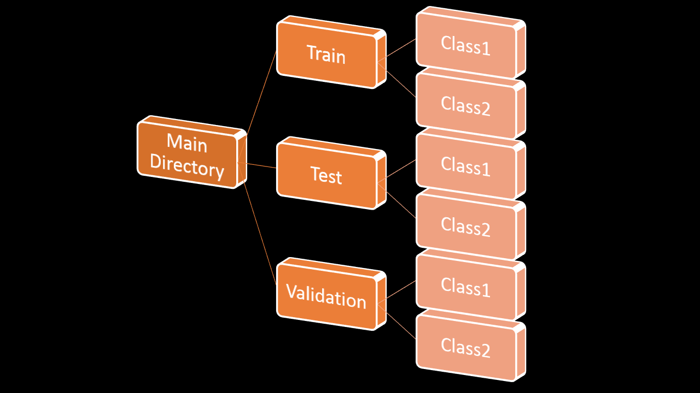

# *Image Processing For Deep learning-FunctionedWay*
>Before Using these functions you have to make sure your directory pattern look like below:


### *Function Available*
>Unzipping File  <br>
>joining_directory_to_each_other_binary_class <br>
>training_filename_show <br>
>train_validation_size <br>
>plotting_image <br>
>resize_labeled_images <br>
>resize_labeled_images_augmentation <br>
>training_with_loading <br>
>load_fit_again_saved_model <br>
>evaluate_the_model_performance <br>
>images_in_conv_layer <br>
>upload_image_to_test <br>
>test_image <br>
>clean_up <br>

1. We will join the directory and thus it will save us huge amount of time. 
```python
from Updated import imagePyTen


import os
import zipfile
import matplotlib.image as mpimg
import matplotlib.pyplot as plt

from tensorflow.keras.preprocessing.image import ImageDataGenerator
import random
from tensorflow.keras.preprocessing.image import img_to_array, load_img
from google.colab import files
import matplotlib.pyplot as plt
from keras.preprocessing import image
```
2. Use as your need.
   
### Get Touch With Me:
[Linkedin](https://linkedin.com/in/rakibhhridoy) <br>
[RakibHHridoy](https://rakibhhridoy.github.io)
